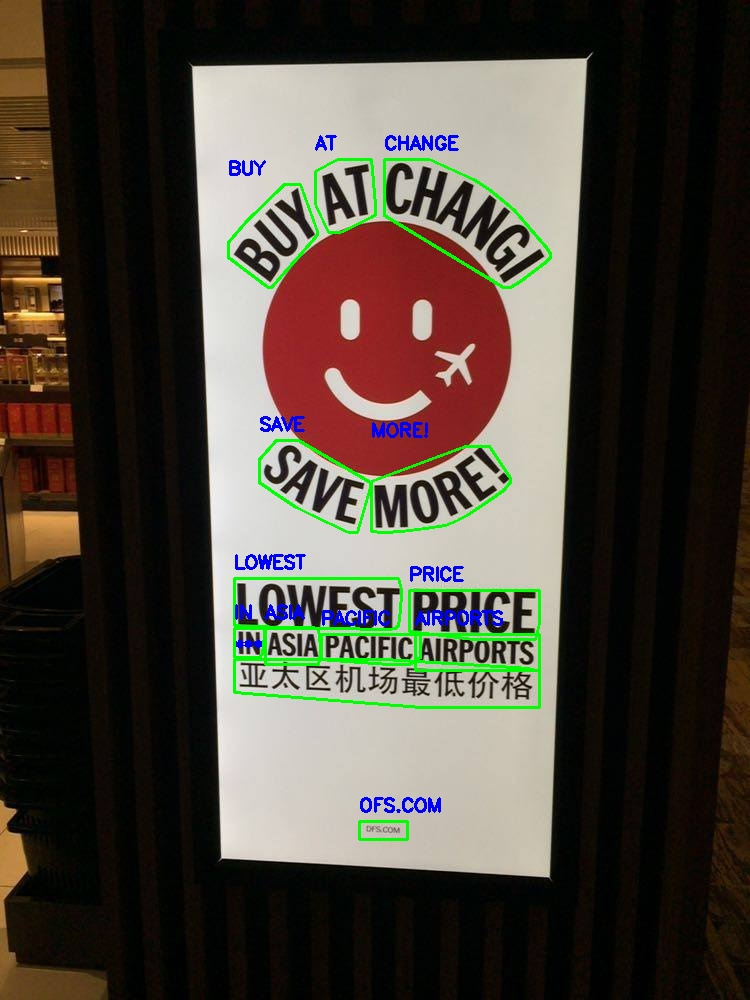

# Scene-Text-Detection-Recognizer
# 📘 Scene Text Detector + Recogniser

This repository provides a complete pipeline for **Scene Text Detection and Recognition**, combining a YOLOv8 segmentation-based detector with state-of-the-art recognizers. It supports detection of polygonal text regions and recognition of textual content from complex scene images.

---

## 📂 Dataset: Total-Text

We use the [Total-Text](https://github.com/cs-chan/Total-Text-Dataset) dataset, which includes:
- **Training images**: 1,255  
- **Testing images**: 300  
- Each image contains horizontal, multi-oriented, and curved text regions.
- Annotations are polygon-based and converted into YOLOv8-seg format for training.

---

## 🔍 Detector + Recogniser Combinations

### 1. YOLOv8-seg + TrOCR Base Stage-1 (`microsoft/trocr-base-stage1`)
- Lightweight and fast
- Ideal for low-resource or real-time applications

### 2. YOLOv8-seg + TrOCR Large Printed (`microsoft/trocr-large-printed`)
- More accurate recognition of printed scene text
- Best suited for high-quality text extraction

---

### ⚙️ Configuration

All paths, weights, thresholds, and model selections are controlled via a single config file:

📁 `Config/config.yaml`

Ensure this file is updated with the correct paths and model names before running any module.

---

### 🧪 Environment Setup

- Python version: `3.10`
- Install dependencies using:

```bash
pip install -r requirements.txt
```


### 🏋️ YOLOv8 Detector Training

Train the segmentation-based YOLOv8 detector using converted polygon annotations:

```bash
python Trainings/Detector_Training/train_yolo_detector.py
```


### 🖼️ Visualisation Module
Visualize both detected text regions and recognized text labels using the selected model:

```bash
python Visualiser/visualise.py \
--input data/Total-Text/Test/img6.jpg \
--detector_weights Trained_weights/yolo_weghts/best.pt \
--recognizer_weights 'microsoft/trocr-large-printed' \
--vis_output 'vis_output'
```



### 📊 Evaluation Module
Evaluate detection and recognition performance using:

- Text Matching Precision (words level):

- Exact Match and Fuzzy Match evaluation

Localization (YOLO detection) Precision:

`81.62%`

#### 📋 Evaluation Results

| Model Combination                | Fuzzy (80%) | Fuzzy (90%) | Exact Match  |
|----------------------------------|-------------|-------------|--------------|
| YOLOv8-seg + TrOCR Base Stage-1  | 45.22       | 39.12       | 36.13        |
| YOLOv8-seg + TrOCR Large Printed | 65.47       | 45.99       | 42.41        |

Run evaluation with:

```bash
python Evaluator/evaluate.py
```

## 🚀 FastAPI Application
Start the app to expose a local inference endpoint:

```bash
python fastapiapp.py
```
The API provides /infer/ for uploading an image and returning detections and recognized text.

### 📡 CURL Request Example
Use curl to test the API endpoint:

```bash
curl -X POST "http://localhost:8000/infer/" \
  -H "accept: application/json" \
  -H "Content-Type: multipart/form-data" \
  -F "image=@/media/pinkal/Data/Scene-Text-Detection-Recognizer/data/Total-Text/Test/img6.jpg"
```

### 📷 Streamlit simple frontend following by FastAPI app

```bash
python streamlitapp.py
```

Thank you!
